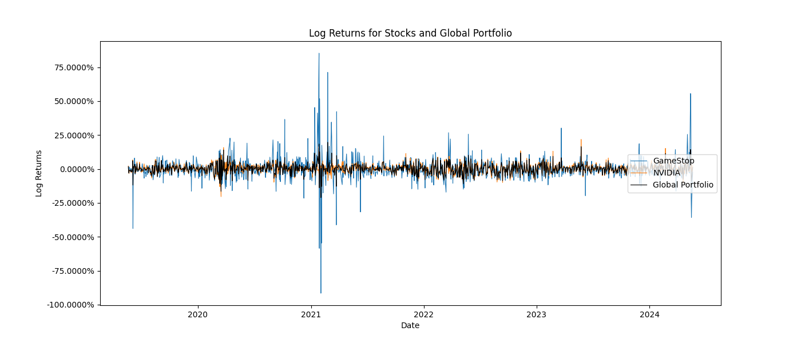
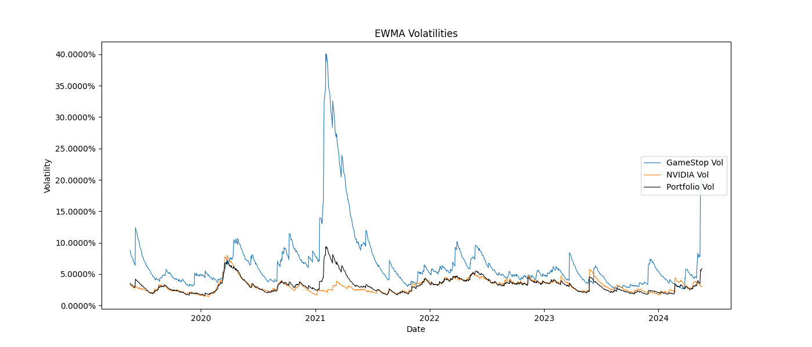
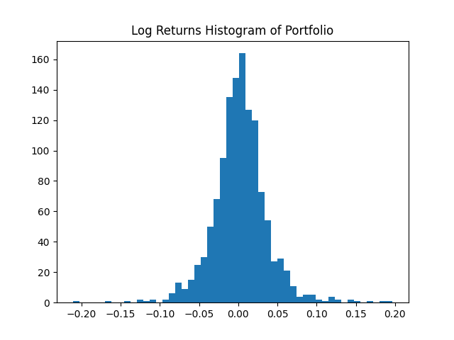
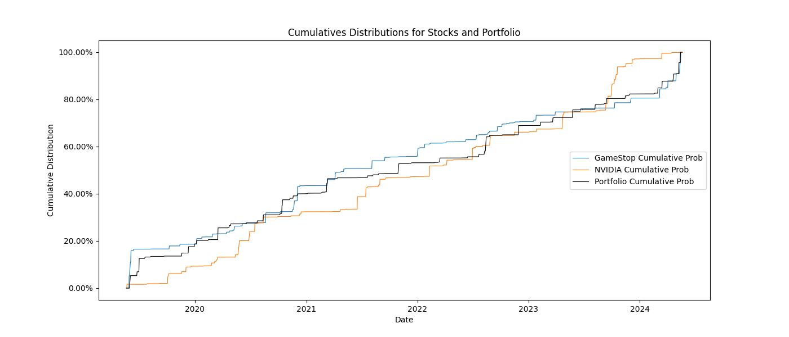

# Portfolio Value at Risk (VaR) Estimation

A Python implementation of a multi-method Value at Risk framework for a two-asset portfolio, replicating and extending an Excel-based risk model.

## Overview

This project estimates the Value at Risk (VaR) and Expected Tail Loss (ETL) of a portfolio consisting of two stocks of your choosing using five distinct methodologies. It reads price data from an Excel file, performs all calculations programmatically, and exports charts to a plots folder.

## Project Structure

```
input/          # Place your .xlsx price data file here
plots/          # Generated charts are saved here
images/         # Example charts shown in this README
var_estimation.py  # Main script
requirements.txt   # Python dependencies
```

## Methodologies

- **Parametric VaR** — based on EWMA volatility and normal distribution (1-day and 10-day)
- **Parametric Systemic VaR** — incorporates stock betas and a market index (NASDAQ)
- **Historical VaR** — empirical percentile of portfolio log returns
- **Cornish-Fisher VaR** — adjusts for skewness and excess kurtosis
- **Stressed Historical VaR** — applies a stress transformation matrix derived from a user-defined stress period

## Key Parameters

At the top of the script, update the following before running:

| Parameter | Description |
|---|---|
| `weights` | Portfolio weights per stock (must sum to 1) |
| `betas` | Market betas per stock (keys must match the Excel column names, in the same order) |
| `parameter_lambda` | EWMA decay factor (default: 0.94) |
| `alpha` | Significance level (default: 0.01) |
| `risk_horizon` | Risk horizon in days (default: 1) |
| `trading_days` | Trading days per year (default: 250) |
| `stress_year` | Year used as the stress period (default: 2021) |

## Input Data Format

The Excel file should contain:
- A `Date` column as the first column
- Exactly two stock columns (e.g. `GameStop`, `NVIDIA`)
- A market index column suffixed with `_INDEX` (e.g. `NASDAQ_INDEX`)

## Output

**Printed results:**
- Annual volatilities and correlations
- Covariance matrices (EWMA, Historical, Stressed)
- Cholesky and Transform matrices
- VaR and ETL estimates across all methods

**Charts saved to `/plots`:**
- Stock price evolution
- Log return histograms per asset
- Log returns time series (stocks + portfolio)
- EWMA volatilities over time
- EWMA covariances over time
- Cumulative return distributions

## Results

Example run on daily closing prices of GameStop, NVIDIA and the NASDAQ index from 20 May 2019 to 20 May 2024 (1,260 observations), using the default parameters: weights of 25% GameStop / 75% NVIDIA, 99% confidence (`alpha = 0.01`), `lambda = 0.94` and 2021 as the stress year.

### VaR and ETL estimates

| Method | Horizon | VaR | ETL |
|---|---|---|---|
| Parametric (EWMA) | 1-day | 13.66% | 15.65% |
| Parametric (EWMA) | 10-day | 43.19% | 49.48% |
| Parametric Systemic (stock betas) | 1-day | 9.15% | — |
| Parametric Systemic (portfolio vs. NASDAQ) | 1-day | 19.21% | — |
| Historical | 1-day | 8.35% | — |
| Cornish-Fisher | 1-day | 10.99% | 15.77% |
| Stressed Historical (2021) | 1-day | 9.97% | — |

### Volatility and correlation

| | GameStop | NVIDIA | Correlation |
|---|---|---|---|
| EWMA annual volatility | 325.56% | 47.24% | 0.128 |
| Historical annual volatility | 138.70% | 51.53% | 0.154 |
| Stressed period (2021) daily volatility | 14.75% | 2.81% | -0.070 |

### Key observations

- **The EWMA estimates are the highest because they weight recent data heavily.** GameStop's volatility spiked again at the end of the sample (May 2024), which pushes its EWMA annual volatility to 325%, more than double its full-sample historical volatility.
- **The portfolio returns have fat tails.** Over the full sample, the portfolio's excess kurtosis is 4.23 (7.23 in 2021). As a result, both the historical VaR (8.35%) and the Cornish-Fisher VaR (10.99%) are above the 7.96% that a normal distribution with the same mean and volatility would give.
- **GameStop's January 2021 short squeeze dominates the stress period.** That year, GameStop's daily volatility was over five times NVIDIA's, and the correlation between the two stocks turned slightly negative.

### Charts









## Dependencies

```
pandas
numpy
matplotlib
scipy
openpyxl
```

Install with:
```
pip install -r requirements.txt
```

## Notes

- The model supports exactly two stocks plus one market index
- The stress period is dynamic — change `stress_year` to any year present in the data
- File paths are relative to the script, so it runs from any location as long as `input/` and `plots/` sit next to it
